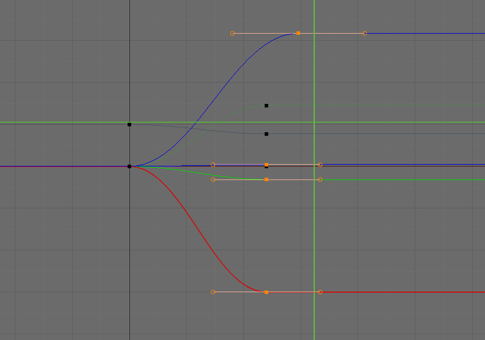

# fcurve



[Blender](https://www.blender.org) uses bezier curves to control animations
called FCurves. This library is a port of the evaluator. Given the same control
point information, it should produce the same output (within a few points of
numeric precision).

Currently, only the bezier interpolation mode is fully supported.

In JS, FCurves should be represented like this:
```js
{
  points: [
    {
      // point interpolation mode (only 'BEZIER' supported)
      interpolation: 'BEZIER',
      // (x, y) coordinate of point
      co: [10, 0],
      // (x, y) coordinate of left handle
      left: [-50, 0],
      // (x, y) coordinate of right handle
      right: [50, 0],
    },
    {
      interpolation: 'BEZIER',
      co: [120, -3],
      left: [70, -3],
      right: [170, -3],
    },
  ]
}
```
